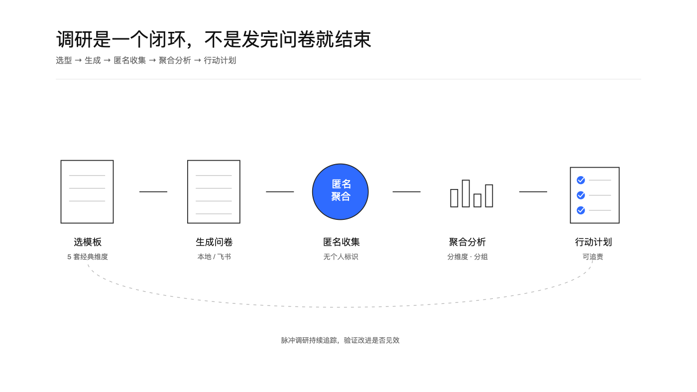
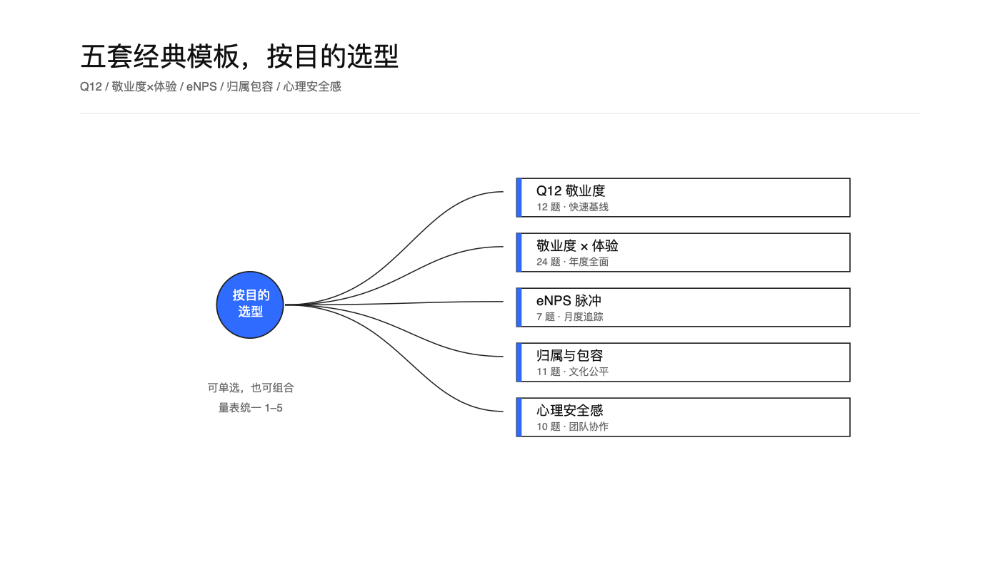
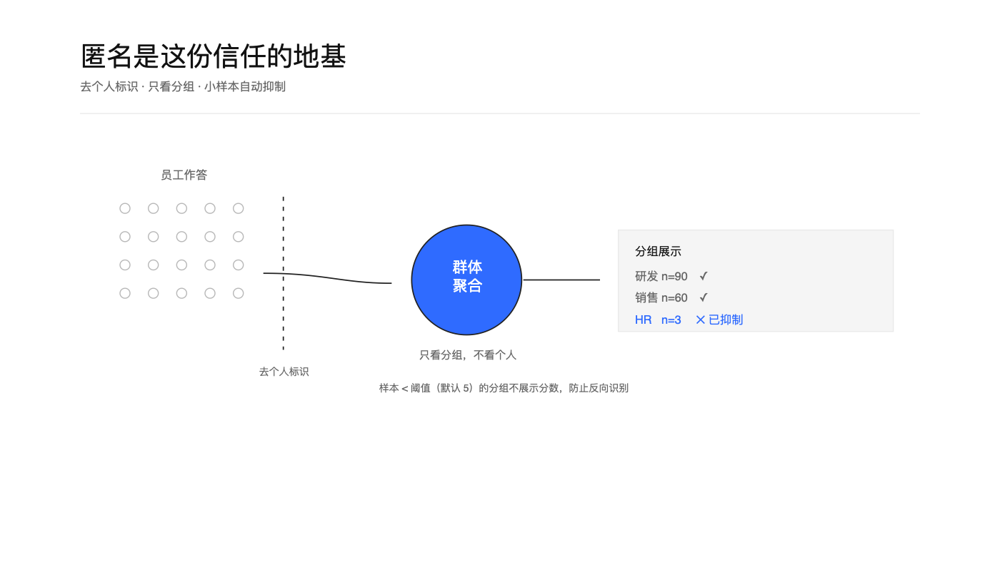
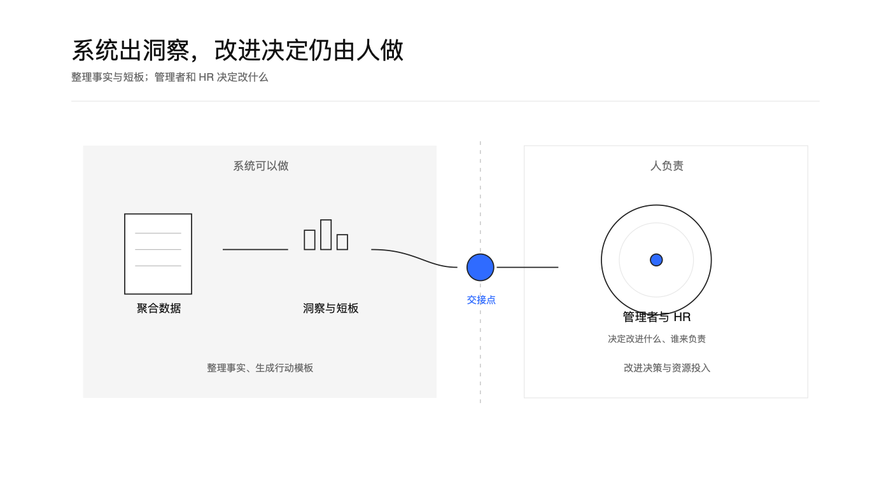

<h1 align="center">员工敬业度匿名调研</h1>

<p align="center">
  <a href="https://github.com/TongyiDai/hr-engagement-survey/actions/workflows/ci.yml"></a>
  
  
  =3.8">
  
</p>

把一次敬业度调研从「设计问卷」到「拿结果做改进」跑成一个可复用、可追踪、守得住匿名边界的闭环。内置五套经典权威维度模板，能自动生成飞书问卷、匿名收集、聚合分析、搭建趋势看板，并把结果落成可追责的行动计划。

<p align="center">
  
</p>

<p align="center">
  
</p>

<p align="center"><sub>匿名聚合的敬业度结果 → 洞察，不做个人识别</sub></p>

## 价值与适用场景

很多敬业度调研失败，不是因为问卷设计得不好，而是**收集完反馈就没有下文**——员工看不到任何改变，下一次就不再说真话。这枚 Skill 解决的正是「从收集到行动」的完整链路，同时把匿名当作硬约束守住。

适合：

- 设计年度全面敬业度调研，或月度/季度脉冲（Pulse）快测。
- 从五套经典模板里按目的选型，而不是从零编题或照搬一份外来问卷。
- 把选定的问卷自动发布成飞书问卷，匿名收集。
- 调研回收后做聚合分析：总分、同比、分维度、按部门/层级/司龄分组、开放题主题。
- 搭建敬业度趋势看板，持续追踪改进是否见效。
- 把短板落成有负责人、时间线、衡量指标的行动计划。
- 只有本地问卷导出或聚合结果、没有任何在线系统时，也能完成设计与分析。

不适合：把敬业度分数用于个人绩效、晋升、调薪、去留判断；按个人反查作答；在小样本分组里做人群画像。

## 五套维度模板

<p align="center">
  
</p>

| 模板 | 权威来源 | 题量 | 适合场景 |
| --- | --- | --- | --- |
| Q12 敬业度 | Gallup Q12 | 12 | 最经典最短，快速测基线 |
| 敬业度 × 员工体验 | Gallup + 员工体验框架 | 24 | 全面年度调研，支撑行动规划 |
| eNPS 脉冲 | Employee NPS | 7 | 月度/季度快测，追踪趋势 |
| 归属与包容 | 归属 / 公平 / 包容 | 11 | 关注文化、归属感、公平 |
| 心理安全感与团队协作 | Edmondson 心理安全感 | 10 | 测团队氛围、发声安全、协作 |

模板可单选也可组合，量表统一 1–5（eNPS 首题为 0–10）。详见 [references/dimension-templates.md](references/dimension-templates.md)。

## 匿名与小样本抑制

<p align="center">
  
</p>

匿名是员工敢说真话的地基。硬规则：不采集任何个人标识；分组维度保持粗粒度；任何分组样本量低于阈值（默认 5）自动抑制，不展示分数；只做聚合，不提供按个人的作答检索。分析脚本会拒绝含个人标识字段的输入。详见 [references/anonymity-boundaries.md](references/anonymity-boundaries.md)。

## 系统出洞察，改进决定由人做

<p align="center">
  
</p>

系统负责把匿名数据整理成群体洞察和行动模板；改进什么、谁来负责、投入多少资源，由管理者和 HR 决定。

## 快速开始

```bash
# 1. 选模板，生成问卷预览
python3 scripts/build_survey.py --template q12 --segments 部门,层级,司龄 --format markdown

# 2. 生成可直接喂给飞书 CLI 的问卷题目 / 字段（发布用）
python3 scripts/build_survey.py --template q12 --segments 部门,层级 --format feishu-questions
python3 scripts/build_survey.py --template q12 --segments 部门,层级 --format feishu-fields

# 3. 回收后，对聚合结果做诊断分析
python3 scripts/analyze_results.py --input tests/fixtures/results-q12.json --min-cell 5 --format markdown
```

飞书问卷发布、Base 聚合、看板搭建的完整命令契约见 [references/feishu-integration.md](references/feishu-integration.md)。

## 目录结构

```text
SKILL.md                    技能主文件（触发、流程、边界）
AGENT-GUIDE.md              跨 Agent 使用须知
references/
  dimension-templates.json  五套模板的机器可读真源
  dimension-templates.md    模板选型说明
  feishu-integration.md     飞书 CLI 命令契约（问卷/Base/看板）
  input-schema.md           脚本输入格式
  anonymity-boundaries.md   匿名与隐私边界
  action-planning.md        从洞察到行动
scripts/
  build_survey.py           问卷生成器（多格式输出）
  analyze_results.py        聚合结果分析器（同比/分组/抑制）
  render_boards.py          Geometry Blue 画板渲染
tests/                      假数据与单元测试
assets/                     画板场景与渲染图
```

## 面向所有 Agent

本 Skill 不绑定任何单一平台。任何能读取 `SKILL.md`、处理用户材料、执行本地 Python 脚本的 Agent 都可使用；飞书是可选的外部集成，缺少时用本地问卷与聚合结果一样能完成。使用方式见 [AGENT-GUIDE.md](AGENT-GUIDE.md)。

## 测试

```bash
python3 tests/test_build_survey.py
python3 tests/test_analyze_results.py
```

## 许可证与出处

MIT，见 [LICENSE](LICENSE)。上游来源、固定版本与扩展说明见 [UPSTREAM.md](UPSTREAM.md) 和 [NOTICE](NOTICE)。题目为中文语境重写，非任何专有问卷的逐字复制；商用前请自行确认所选框架的授权要求。
